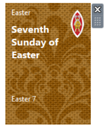
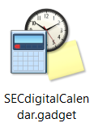

# SEC digital calendar Windows Sidebar Gadget

View the Scottish Episcopal Church digital calendar and lectionary in a Windows Sidebar Gadget.

Windows Vista and Windows 7 supported Sidebar Gadgets, mini applications that sat on the desktop or on a sidebar. These are still available in Windows 7, 8, 8.1, 10 and 11 by installing the application [8GadgetPack](https://8gadgetpack.net/).

## How it works

The gadget displays the latest information from the [SEC digital calendar](https://www.seccalendar.org.uk/) website.

Hover over the feast day to view more information in a tooltip. This will show:

* Date
* Season
* Feast day
* Feast class (1 to 6)
* Liturgical colour
* Translated
* Ember or rogation day

Currently, the gadget does not automatically update after midnight. To manually refresh the gadget, click the SEC logo in the top-right corner.

## Installation

1. Download and install [8GadgetPack](https://8gadgetpack.net/).
2. Download [`SECdigitalCalendar-v1.0.0.gadget`](https://github.com/garethjmsaunders/sec-digital-calendar-windows-sidebar-gadget/blob/main/SECdigitalCalendar-v1.0.0.gadget?raw=true) from this repository and double-click the icon to install.
3. Right-click the desktop and select Gadgets.
4. Navigate to the SEC digital calendar gadget and either right-click and select Add or drag-and-drop the gadget onto your desktop.

## Manual installation

Alternatively...

1. Download and install [8GadgetPack](https://8gadgetpack.net/).
2. Create a new folder called `SECdigitalCalendar.gadget`.
3. Download the files from this repository into the new folder.
4. Press `Win + R` to open the Run dialog.
5. Copy this path into the Run dialog: `%USERPROFILE%\AppData\Local\Microsoft\Windows Sidebar\Gadgets`.
6. Click OK.
7. A new Windows Explorer window will open.
7. Copy your newly created folder called `SECdigitalCalendar.gadget` into the `...\Windows Sidebar\Gadgets` folder.
8. Right-click the desktop and select Gadgets.
9. Navigate to the SEC digital calendar gadget and either right-click and select Add or drag-and-drop the gadget onto your desktop.

## How to manually create the .gadget file

1. Create a new folder called `SECdigitalCalendar.gadget`.
2. Download the files from this repository into the new folder.
3. Compress the folder into a zip file.
4. Delete the `SECdigitalCalendar.gadget` folder.
5. Rename your zip file to `SECdigitalCalendar.gadget`.
6. Assuming that you have downloaded and installed [8GadgetPack](https://8gadgetpack.net/), the zip/gadget file icon will now change to a Windows Sidebar Gadget icon.

